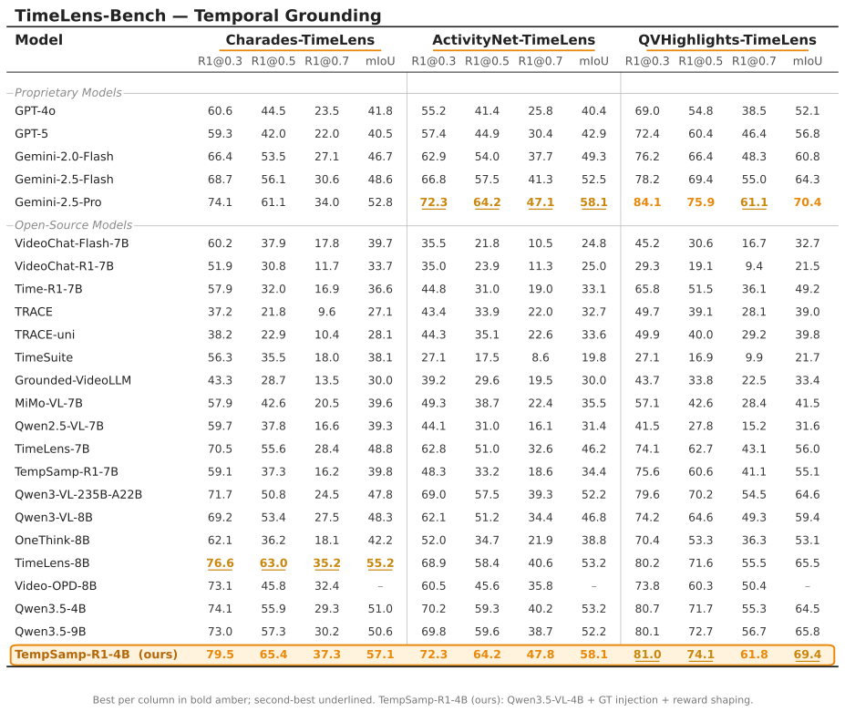

<div align="center">

# TempSamp-R1: Effective Temporal Sampling with Reinforcement Fine-Tuning for Video LLMs

**Yunheng Li**<sup>1</sup> · **Jing Cheng**<sup>1</sup> · **Shaoyong Jia**<sup>2</sup> · **Hangyi Kuang**<sup>1</sup> · **Shaohui Jiao**<sup>2</sup> · **Qibin Hou**<sup>1†</sup> · **Ming-Ming Cheng**<sup>1</sup>

<sup>1</sup> VCIP, Nankai University &nbsp;&nbsp; <sup>2</sup> ByteDance Inc.

<sup>†</sup> Corresponding author

[](https://arxiv.org/abs/2509.18056)
[](https://arxiv.org/abs/2509.18056)
[](LICENSE)

</div>

> [!TIP]
> If you find this project useful, please consider giving it a ⭐ and citing our paper — it really helps the project grow and lets more people discover it. See [Citation](#citation).

An open-source implementation of **TempSamp-R1** for **video temporal grounding**, built on top of the [EasyR1](https://github.com/hiyouga/EasyR1) / [verl](https://github.com/volcengine/verl) RL training stack. It contributes two pieces on top of vanilla GRPO:

1. **GT injection** — replace one slot of each rollout group with the ground-truth answer (mix-policy GRPO).
2. **Non-linear reward shaping** — log-compress high rewards and exp-amplify low rewards before advantage computation.

GT injection lives in [`verl/trainer/ray_trainer.py`](verl/trainer/ray_trainer.py) (`RayPPOTrainer._inject_gt_rollout_in_gen_output`); reward shaping (`transform_rewards`) and the GT-response builder (`build_gt_response`) live in [`scripts/timelens/timelens_reward.py`](scripts/timelens/timelens_reward.py).


## Results

Performance on **TimeLens-Bench** (Charades / ActivityNet / QVHighlights-TimeLens). **TempSamp-R1-4B** = Qwen3.5-VL-4B + GT injection + reward shaping. For each column, the best score is shown in **bold amber** and the second-best is <u>underlined</u>.

<p align="center">
  
</p>


<details style="margin: 1.5em 0;">
<summary><h2 style="display: inline-block; margin: 0 0 0.75em 0; padding: 0;">Installation</h2></summary>

The combination below is the exact one we have verified end-to-end on **8 × NVIDIA H20 (sm_90, CUDA 12.6 runtime)** with Qwen3.5-VL-4B. Newer toolkits (CUDA 12.8 PyTorch wheels) are forward-compatible with the CUDA 12.6 driver.

| Package | Version |
|---|---|
| Python | 3.12 |
| PyTorch | 2.10.0 + cu128 |
| Triton | 3.6.0 (ships with torch) |
| vLLM | 0.19.1 |
| transformers | 5.5.4 |
| flash-attn | 2.8.1 |
| flash-linear-attention | 0.4.2 |
| ray | 2.54.0 |
| qwen-vl-utils | 0.0.14 |
| decord | 0.6.0 |

```bash
conda create -n tempsamp-verl python=3.12 -y
conda activate tempsamp-verl

# 1) torch + triton (Triton 3.6 ships with the cu128 wheel)
pip install torch==2.10.0 torchvision torchaudio --index-url https://download.pytorch.org/whl/cu128

# 2) Project + pinned deps (in-tree editable verl)
pip install -e .

# 3) flash-attn — install a prebuilt wheel that matches torch + cu + cp + ABI.
#    First check your cxx11 ABI flag:
#      python -c "import torch; print(torch._C._GLIBCXX_USE_CXX11_ABI)"
#    Then download the matching wheel from
#      https://github.com/Dao-AILab/flash-attention/releases
#    Example (torch 2.10 / cu12 / cp312 / ABI=True):
pip install flash-attn==2.8.1 --no-build-isolation
```

Sanity check:

```bash
python - <<'PY'
import torch, vllm, transformers, flash_attn
print('torch       :', torch.__version__, 'cuda', torch.version.cuda)
print('vllm        :', vllm.__version__)
print('transformers:', transformers.__version__)
print('flash_attn  :', flash_attn.__version__)
print('GPU         :', torch.cuda.get_device_name(0))
print('compute cap :', torch.cuda.get_device_capability(0))
PY
```

> **Note:** Do **not** `pip install opencv-python` — it pulls in a `libGL.so.1`
> dependency that is missing on headless servers and crashes the vLLM eval at
> import time. `requirements.txt` pins `opencv-python-headless` instead, which
> is API-compatible.

Adjust `NPROC_PER_NODE`, `CUDA_VISIBLE_DEVICES`, and `worker.rollout.tensor_parallel_size` in the scripts to match your hardware.

</details>

<details style="margin: 1.5em 0;">
<summary><h2 style="display: inline-block; margin: 0 0 0.75em 0; padding: 0;">Data</h2></summary>

Train on **TimeLens-100K**, evaluate on the 3 subtasks of **TimeLens-Bench**. Expected layout:

```
datasets/
├── TimeLens-100K/
│   ├── videos/*.mp4
│   └── (optional) preprocessed_videos/*.pt
└── TimeLens-Bench/
    ├── charades-timelens.json
    ├── activitynet-timelens.json
    ├── qvhighlights-timelens.json
    └── video_shards/{charades,activitynet,qvhighlights}/*.mp4
```

The pipeline has two stages. **Stage A is required**; **Stage B is optional but recommended** (it removes per-epoch video decoding and is a large training-time win).

### Stage A — Convert raw JSONL → trainer JSONL (fills absolute video paths)

```bash
python data/convert_timelens_to_verl.py \
    --input      /path/to/timelens-100k.jsonl \
    --output     data/timelens_grpo_train.jsonl \
    --video_root /path/to/datasets/TimeLens-100K
```

`--video_root` is prepended to every relative video path in the source so the
output JSONL always has fully-resolved absolute paths.

We ship the **exact 2000-row training subset** used to produce our reported
TempSamp-R1 numbers at
[`data/timelens_grpo_train.jsonl`](data/timelens_grpo_train.jsonl) (a
difficulty-stratified sample of TimeLens-100K). Video paths there are kept
relative — `video_shards/<source>/<vid>.mp4` — so before you train you should
either (a) rerun Stage A with your local `--video_root` to absolutise them, or
(b) point `data.image_dir` / `--image_dir` at your TimeLens-100K root.

Each output line:

```json
{
  "problem": "<video>To accurately pinpoint the event \"...\" in the video, ... <answer> 12.5 to 17.8 </answer>.",
  "answer":  "<answer> 7.0 to 11.0 </answer>",
  "problem_type": "temporal grounding",
  "data_type": "video",
  "videos": ["/abs/path/to/video.mp4"]
}
```

### Stage B — (Optional) Offline-decode videos into `.pt` cache

The trainer's default rollout path decodes every video on every epoch. Doing
the decode once offline turns each step's video I/O into a single `torch.load`
of a `.pt` file. Parameters here (fps / pixel caps / max_frames) must match
the training YAML or the loader will silently fall back to realtime decode.

```bash
INPUT_FILE=data/timelens_grpo_train.jsonl \
OUTPUT_DIR=data/preprocessed_videos \
OUTPUT_FILE=data/timelens_grpo_train.preprocessed.jsonl \
  bash scripts/preprocess_videos.sh
```

Then point the training YAML at the preprocessed cache:

```yaml
data:
  train_files:             data/timelens_grpo_train.preprocessed.jsonl
  use_preprocessed_videos: true
  video_source_mode:       prefer_preprocessed   # or preprocessed_only
  preprocessed_video_dir:  data/preprocessed_videos
```

(These are already wired through env vars in `scripts/train/timelens_*.sh` —
set `TIMELENS_USE_PREPROCESSED=true`, `TIMELENS_VIDEO_SOURCE_MODE=prefer_preprocessed`,
`TIMELENS_PREPROCESSED_VIDEO_DIR=...`, and `TIMELENS_TRAIN_FILES=...preprocessed.jsonl`
before launching training.)

</details>

## Training

```bash
# Vanilla GRPO baseline
TIMELENS_MODEL_PATH=/path/to/Qwen3.5-VL-4B \
TIMELENS_TRAIN_FILES=data/timelens_grpo_train.jsonl \
  bash scripts/train/timelens_grpo.sh

# TempSamp-R1 (GT injection + reward shaping)
TIMELENS_MODEL_PATH=/path/to/Qwen3.5-VL-4B \
TIMELENS_TRAIN_FILES=data/timelens_grpo_train.jsonl \
  bash scripts/train/timelens_tempsamp.sh
```

## Evaluation

```bash
# Single-step eval on TimeLens-Bench (all 3 subtasks) using vLLM
BASE_MODEL=/path/to/Qwen3.5-VL-4B \
BENCH_DIR=/path/to/datasets/TimeLens-Bench \
  bash scripts/eval/eval_timelens_bench.sh /path/to/checkpoint/global_step_NNN/actor
```

You can constrain to a single dataset:

```bash
DATASETS=charades-timelens bash scripts/eval/eval_timelens_bench.sh /path/to/actor
```

## Citation

If you find our work helpful for your research, please consider giving this repo a star ⭐ and citing our paper. We appreciate your support!

```bibtex
@inproceedings{li2026tempsamp,
  title     = {TempSamp-R1: Effective Temporal Sampling with Reinforcement Fine-Tuning for Video LLMs},
  author    = {Li, Yunheng and Cheng, Jing and Jia, Shaoyong and Kuang, Hangyi and Jiao, Shaohui and Hou, Qibin and Cheng, Ming-Ming},
  booktitle = {Advances in Neural Information Processing Systems},
  volume    = {38},
  pages     = {40692--40716},
  year      = {2026}
}
```

## Acknowledgements

Built on [verl](https://github.com/volcengine/verl), [EasyR1](https://github.com/hiyouga/EasyR1), [vLLM](https://github.com/vllm-project/vllm), and [Qwen3-VL](https://github.com/QwenLM/Qwen3-VL). Released under [Apache 2.0](LICENSE).
